<!--
  README de profil GitHub — Dev Full-Stack
-->

<h1 align="center">
  Salut, moi c'est Xwdrblue👋
</h1>

  

  
  
  
  

---

### 🚀 À propos de moi

- 🔭 Je travaille actuellement sur **mon site perso et des projets embarqués Arduino**
- 🌱 J'apprends en ce moment le **C/C++**

---

### 🛠️ Stack technique
**Frontend**

**Backend**

**Base de données**

**DevOps & Outils**

---

### 📌 Projets en vedette

| Projet | Description | Stack |
|--------|-------------|-------|
| [**Hall-e**](https://github.com/hugo38rodrigues/hall-e) | Application mobile permettant de suivre le planning et les horaires de diffusion de vos équipes d'e-sport favorites. | Flutter · Node · SQL |
| [**GazSensorRobot**](https://github.com/hugo38rodrigues/GazSensorRobot) | Robot détecteur d'incendie dans une usine | Arduino · C++|

---

### 📊 Mes statistiques GitHub

  
  

  

  

---

<i>«Résolution de problèmes, apprentissage continu et sens des responsabilités définissent mon approche professionnelle. .»</i>

